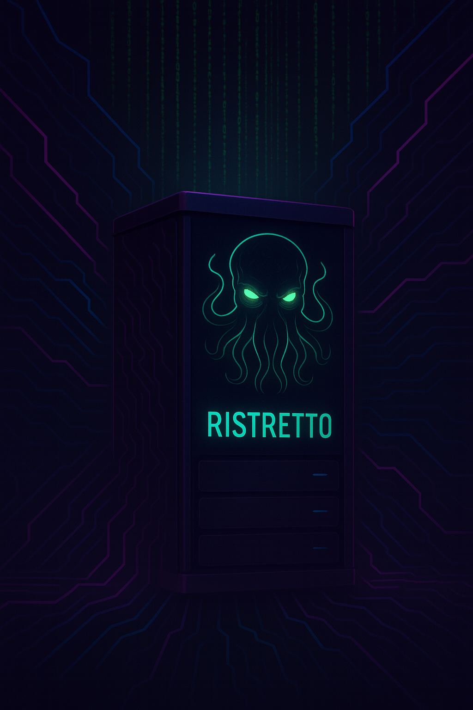

# RistrettoDB


> "Bygget på koffein og høy hastighet!"

A tiny, blazingly fast, **embeddable** SQL engine in C that delivers **4.57x performance improvement** over SQLite with **4.6 million rows/second** throughput and **215ns per row** latency. Perfect for embedding in C/C++ applications, language bindings, and high-performance systems.

## Quick Start (5 minutes)

```bash
# 1. Clone and build the library
git clone https://github.com/MonkeyIsNull/RistrettoDB && cd RistrettoDB
make lib

# 2. Copy the header and link the library
cp embed/ristretto.h /usr/local/include/
cp lib/libristretto.a /usr/local/lib/

# 3. Create your first application
cat > hello_ristretto.c << 'EOF'
#include "ristretto.h"
#include <stdio.h>

int main() {
    printf("RistrettoDB Version: %s\n", ristretto_version());
    
    RistrettoDB* db = ristretto_open("hello.db");
    ristretto_exec(db, "CREATE TABLE test (id INTEGER, name TEXT)");
    ristretto_exec(db, "INSERT INTO test VALUES (1, 'Hello World')");
    ristretto_close(db);
    
    printf("Successfully embedded RistrettoDB!\n");
    return 0;
}
EOF

# 4. Compile and run
gcc -O3 hello_ristretto.c -lristretto -o hello_ristretto
./hello_ristretto
```

**Output:**
```
RistrettoDB Version: 2.0.0
Successfully embedded RistrettoDB!
```

## Why Choose RistrettoDB?

| **Scenario** | **RistrettoDB** | **SQLite** | **Performance Gain** |
|--------------|-----------------|------------|---------------------|
| **High-speed logging** | 4.6M rows/sec | 1.0M rows/sec | **4.6x faster** |
| **IoT telemetry** | 215ns/row | 984ns/row | **4.6x lower latency** |
| **Embedded systems** | 42KB library | 1.2MB library | **29x smaller** |
| **Language bindings** | Single header | Complex build | **Simple integration** |

### Perfect For:
- **Real-time analytics** ingestion (4.6M+ events/sec)
- **IoT and embedded** systems (minimal footprint)
- **Security audit** trails (tamper-evident logs)
- **Language bindings** (Python, Node.js, Go, Rust)
- **High-frequency trading** data capture
- **Game telemetry** and metrics collection

### Not Recommended For:
- Applications requiring UPDATE/DELETE operations
- Complex SQL queries (JOINs, subqueries)
- Multi-user concurrent databases
- General-purpose CRUD applications

## SQLite-Style Embedding

RistrettoDB is designed for **drop-in embedding** with zero dependencies and a single header file, just like SQLite but optimized for high-speed writes.

### Single Header Integration

```c
#include "ristretto.h"  // Everything you need in one header

// Choose your API based on performance needs:
// 1. Original SQL API (2.8x faster than SQLite)
// 2. Table V2 Ultra-Fast API (4.6x faster than SQLite)
```

### Build Targets

```bash
# Static library (recommended for embedding)
make lib && ls -la lib/
# libristretto.a     42KB    # Tiny static library
# libristretto.so    56KB    # Dynamic library 

# Embedded (single-file distribution)
make embedded && ls -la embed/
# ristretto.c        # All code in one file (embedded)
# ristretto.h        # Single header (15KB)
```

### Language Bindings

**Python Integration:**
```python
from ristretto import RistrettoDB, RistrettoTable, RistrettoValue

# Original SQL API (2.8x faster than SQLite)
with RistrettoDB("myapp.db") as db:
    db.exec("CREATE TABLE users (id INTEGER, name TEXT)")
    results = db.query("SELECT * FROM users")
    
# Table V2 API (4.57x faster than SQLite)
with RistrettoTable.create("events", "CREATE TABLE events (id INTEGER)") as table:
    table.append_row([RistrettoValue.integer(1)])

# See examples/python/ for complete bindings and examples
```

**Node.js Integration:**
```javascript
const { RistrettoDB, RistrettoTable, RistrettoValue } = require('./ristretto');

// Original SQL API (2.8x faster than SQLite)
const db = new RistrettoDB('myapp.db');
db.exec('CREATE TABLE users (id INTEGER, name TEXT)');
const results = db.query('SELECT * FROM users');
db.close();

// Table V2 API (4.57x faster than SQLite)
const table = RistrettoTable.create('events', 'CREATE TABLE events (id INTEGER)');
table.appendRow([RistrettoValue.integer(1)]);
table.close();

// See examples/nodejs/ for complete bindings and examples
```

**Go Integration:**
```go
import "./ristretto"

// Original SQL API (2.8x faster than SQLite)
db, err := ristretto.Open("myapp.db")
if err != nil { log.Fatal(err) }
defer db.Close()

err = db.Exec("CREATE TABLE users (id INTEGER, name TEXT)")
results, err := db.Query("SELECT * FROM users")

// Table V2 API (4.57x faster than SQLite)  
table, err := ristretto.CreateTable("events", "CREATE TABLE events (id INTEGER)")
defer table.Close()

values := []ristretto.Value{ristretto.IntegerValue(1)}
err = table.AppendRow(values)

// See examples/go/ for complete bindings and examples
```

### Real-World Examples

Our [examples/](examples/) directory contains working demonstrations:

**C/C++ Examples:**
- [`embedding_demo.c`](examples/embedding_demo.c) - Complete embedding guide
- [`working_demo.c`](examples/working_demo.c) - Production-ready patterns  
- [`raw_api_demo.c`](examples/raw_api_demo.c) - Direct API usage
- [`direct_api_demo.c`](examples/direct_api_demo.c) - High-performance setup

**Language Bindings:**
- [`python/`](examples/python/) - Complete Python bindings (ctypes-based)
- [`nodejs/`](examples/nodejs/) - Complete Node.js bindings (ffi-napi-based)
- [`go/`](examples/go/) - Complete Go bindings (cgo-based)

**Run the examples:**
```bash
make lib                    # Build libraries first

# C/C++ Examples
make examples              # Build all C examples
./examples/embedding_demo  # See complete demonstration

# Language Binding Examples
cd examples/python && python3 example.py     # Python demo
cd examples/nodejs && npm install && node example.js  # Node.js demo  
cd examples/go && go run example.go          # Go demo (requires CGO setup)
```

### Production Deployment

**Docker Integration:**
```dockerfile
FROM alpine:latest
RUN apk add --no-cache gcc musl-dev
COPY lib/libristretto.a /usr/lib/
COPY ristretto.h /usr/include/
```

**CI/CD Integration:**
```yaml
# GitHub Actions example
- name: Build with RistrettoDB
  run: |
    make lib
    gcc -O3 myapp.c -lristretto -o myapp
    ./myapp
```

## What is RistrettoDB?

RistrettoDB is a specialized embedded database engine optimized for extreme performance in specific use cases. Named after the concentrated espresso shot, it delivers maximum performance in a minimal package by focusing on a carefully chosen subset of SQL functionality.

Unlike general-purpose databases, RistrettoDB trades broad feature support for raw speed through:
- Zero-copy memory-mapped I/O
- Hard-coded execution pipelines (no virtual machine overhead)
- SIMD-vectorized operations
- Fixed-width row layouts
- Direct memory access patterns


## Features

### Core SQL Support
- **CREATE TABLE** - Define tables with typed columns
- **INSERT** - Add data with automatic type checking and conversion
- **SELECT** - Query data with table scanning

### Supported Data Types
- `INTEGER` - 64-bit signed integers
- `REAL` - Double-precision floating point
- `TEXT` - Variable-length strings (up to 255 chars)
- `NULL` - Null values

### Storage Features
- Memory-mapped file storage for zero-copy I/O
- Fixed-width row format for predictable performance
- 4KB page-aligned data access
- B+Tree indexing for efficient lookups
- Persistent storage to disk

## Performance Features

RistrettoDB is engineered for maximum performance through several key optimizations:

### Memory-Mapped I/O
- Direct file access via `mmap()` eliminates buffer copying
- Zero-copy data access reduces memory allocations
- Page-aligned data structures for cache efficiency

### SIMD Vectorization
- Clang vector extensions for cross-platform SIMD
- 4x faster filtering operations on integer/float columns
- Vectorized bitmap operations for complex WHERE clauses
- Manual prefetching for cache optimization

### Hard-Coded Execution Paths
- No bytecode interpreter or virtual machine overhead
- Direct function calls for all operations
- Inlined execution pipelines
- Static query plan structures

### Fixed-Width Row Format
- Eliminates variable-length parsing overhead
- Enables direct memory access to column data
- Predictable cache behavior
- 8-byte aligned column layout

### Compiler Optimizations
- Built with `-O3 -march=native` for maximum optimization
- Platform-specific instruction generation
- Link-time optimization ready

## How It Works

### Architecture Overview

```
┌─────────────────┐    ┌──────────────────┐    ┌─────────────────┐
│   SQL Parser    │ -> │  Query Planner   │ -> │  Execution      │
│  (parser.c)     │    │   (query.c)      │    │  (query.c)      │
└─────────────────┘    └──────────────────┘    └─────────────────┘
         |                       |                       |
         v                       v                       v
┌─────────────────┐    ┌──────────────────┐    ┌─────────────────┐
│  Statement      │    │  QueryPlan       │    │  TableScanner   │
│  Structures     │    │  Structures      │    │  (storage.c)    │
└─────────────────┘    └──────────────────┘    └─────────────────┘
                                                         |
                                                         v
                                               ┌─────────────────┐
                                               │  Memory-Mapped  │
                                               │  Pager          │
                                               │  (pager.c)      │
                                               └─────────────────┘
```

### Execution Flow

1. **Parse SQL** → Convert SQL text to structured statements
2. **Plan Query** → Create direct execution plans (no optimization)
3. **Execute** → Run hard-coded execution paths
4. **Storage** → Direct memory-mapped file access

### Data Storage Layouts


RistrettoDB supports two storage formats optimized for different use cases:

#### Table V2 Ultra-Fast Format (table_v2.c)

```
File Layout (per table):
┌─────────────────────────────────────────────────────────────┐
│                    TableHeader (256 bytes)                 │
│  Magic(8) | Version(4) | RowSize(4) | NumRows(8) | ...    │
│  ColumnDescs[14] (16 bytes each) | Reserved(12)           │
├─────────────────────────────────────────────────────────────┤
│                         Row Data                            │
│  Row 0 (fixed-width) | Row 1 | Row 2 | ... | Row N       │
└─────────────────────────────────────────────────────────────┘

Row Layout (Fixed-Width, Memory-Aligned):
┌─────────────┬─────────────┬─────────────┬─────────────┐
│  Column 1   │  Column 2   │  Column 3   │    ...      │
│ INTEGER(8)  │ TEXT(32)    │ REAL(8)     │             │
│ @ offset 0  │ @ offset 8  │ @ offset 40 │             │
└─────────────┴─────────────┴─────────────┴─────────────┘

Features:
• Zero-copy memory-mapped access
• Fixed-width rows for predictable performance  
• Direct append writes (4.6M rows/sec)
• File grows in 1MB+ blocks
```

#### Original B+Tree Format (storage.c/btree.c)

```
File Layout:
┌─────────────┬─────────────┬─────────────┬─────────────┐
│   Page 0    │   Page 1    │   Page 2    │    ...      │
│ (4KB)       │ (4KB)       │ (4KB)       │             │
└─────────────┴─────────────┴─────────────┴─────────────┘

Page Layout:
┌─────────────┬─────────────┬─────────────┬─────────────┐
│ Page Header │    Row 1    │    Row 2    │    ...      │
│ (8 bytes)   │ (variable)  │ (variable)  │             │
└─────────────┴─────────────┴─────────────┴─────────────┘

Features:
• B+Tree indexed access
• Variable-width rows
• SQL parser integration
• 2.8x faster than SQLite
```

## Building

### Prerequisites
- Clang compiler (recommended for SIMD support)
- POSIX-compliant system (Linux, macOS, BSD)

### Build Commands

```bash
# Build embeddable libraries (recommended)
make lib                    # Static (.a) and dynamic (.so) libraries

# Standard CLI build
make                        # Build ristretto CLI tool

# Debug builds
make debug                  # CLI with debug symbols
make lib-debug             # Libraries with debug symbols

# Distribution builds
make embedded          # Single-file distribution in dist/

# Testing
make test                  # Basic functionality tests
make test-comprehensive    # Validates all programming manual examples
make test-all             # Complete test suite

# Examples and benchmarks
make examples             # Build all embedding examples
make benchmark           # Performance benchmarks vs SQLite

# Utilities
make clean               # Clean build artifacts
make format             # Format code
```

### Build Outputs

```bash
lib/libristretto.a         # Static library (42KB) - recommended for embedding
lib/libristretto.so        # Dynamic library (56KB)
embed/ristretto.h          # Single public header (15KB)
embed/ristretto.c          # Embedded (single-file distribution)
bin/ristretto              # CLI tool
examples/                  # Working embedding examples
```

## Programming Manual

**For comprehensive examples and detailed API documentation, see the [Programming Manual](doc/PROGRAMMING_MANUAL.md)**

The manual includes:
- Complete build instructions and setup
- Extensive examples for both Original and Table V2 APIs
- Real-world use cases (IoT telemetry, security logging, analytics)
- Performance optimization techniques
- Best practices and troubleshooting

> **Testing**: Run `make test-comprehensive` to validate all programming manual examples and performance claims work correctly on your system.

## Usage Examples

### Embedding in Your Application

**Single Header Integration:**
```c
#include "ristretto.h"  // Everything you need

int main() {
    printf("RistrettoDB %s embedded successfully!\n", ristretto_version());
    
    // Original SQL API (2.8x faster than SQLite)
    RistrettoDB* db = ristretto_open("myapp.db");
    ristretto_exec(db, "CREATE TABLE logs (timestamp INTEGER, message TEXT)");
    ristretto_exec(db, "INSERT INTO logs VALUES (1672531200, 'App started')");
    ristretto_close(db);
    
    // Table V2 Ultra-Fast API (4.6x faster than SQLite)  
    Table* table = table_create("metrics", 
        "CREATE TABLE metrics (timestamp INTEGER, value REAL)");
    
    Value values[2];
    values[0] = value_integer(1672531200);
    values[1] = value_real(42.0);
    table_append_row(table, values);
    table_close(table);
    
    return 0;
}
```

**Compile and link:**
```bash
gcc -O3 myapp.c -lristretto -o myapp
```

### Command Line Interface

```bash
# Start the REPL
bin/ristretto

# Use a specific database file  
bin/ristretto mydata.db
```

### API Comparison

#### Original SQL API - General Purpose (2.8x faster than SQLite)

```c
#include "ristretto.h"

int main() {
    RistrettoDB* db = ristretto_open("example.db");
    
    // Standard SQL interface
    ristretto_exec(db, "CREATE TABLE products (id INTEGER, name TEXT, price REAL)");
    ristretto_exec(db, "INSERT INTO products VALUES (1, 'Laptop', 999.99)");
    ristretto_query(db, "SELECT * FROM products", my_callback, NULL);
    
    ristretto_close(db);
    return 0;
}
```

#### Table V2 Ultra-Fast API - High Performance (4.6x faster than SQLite)

```c
#include "ristretto.h"

int main() {
    // Ultra-fast table for high-speed writes
    Table* table = table_create("events", 
        "CREATE TABLE events (timestamp INTEGER, user_id INTEGER, event TEXT(32))");
    
    // Optimized for 4.6M+ rows/second throughput
    Value values[3];
    values[0] = value_integer(1672531200);
    values[1] = value_integer(12345);
    values[2] = value_text("user_login");
    
    table_append_row(table, values);
    
    // Clean up text values (important!)
    value_destroy(&values[2]);
    table_close(table);
    return 0;
}
```

### Real-World Example: IoT Data Logger

```c
#include "ristretto.h"
#include <time.h>

int main() {
    // Create high-speed sensor data table
    Table* sensors = table_create("sensor_data",
        "CREATE TABLE sensor_data ("
        "timestamp INTEGER, device_id INTEGER, "
        "temperature REAL, humidity REAL)");
    
    printf("Logging 10,000 sensor readings...\n");
    clock_t start = clock();
    
    for (int i = 0; i < 10000; i++) {
        Value values[4];
        values[0] = value_integer(time(NULL) + i);
        values[1] = value_integer(i % 100);  // device_id
        values[2] = value_real(20.0 + (i % 30));  // temperature
        values[3] = value_real(40.0 + (i % 40));  // humidity
        
        table_append_row(sensors, values);
    }
    
    double elapsed = ((double)(clock() - start)) / CLOCKS_PER_SEC;
    printf("Logged 10,000 readings in %.3f seconds\n", elapsed);
    printf("Throughput: %.0f readings/second\n", 10000.0 / elapsed);
    
    table_close(sensors);
    return 0;
}
```

### Performance Testing

```bash
# Create a large dataset
for i in {1..10000}; do
    echo "INSERT INTO benchmark VALUES ($i, 'Item$i', $(( RANDOM % 1000 )).99);"
done | bin/ristretto bench.db

# Time SELECT operations
time echo "SELECT * FROM benchmark;" | bin/ristretto bench.db > /dev/null
```

### Running Benchmarks

RistrettoDB includes a comprehensive benchmarking suite to compare performance against SQLite:

```bash
# Build and run all benchmarks
make benchmark

# Run specific benchmark suites
make benchmark-vs-sqlite      # Head-to-head comparison
make benchmark-micro          # Detailed performance analysis
make benchmark-speedtest      # SQLite speedtest1 subset
make benchmark-ultra-fast     # Ultra-fast write performance

# Build benchmark executables only
make benchmark-build
```

The benchmark suite includes:
- **Ultra-fast benchmark** measuring peak write performance (4.6M rows/sec)
- **Direct comparison** with SQLite on equivalent operations
- **Microbenchmarks** measuring CPU time, memory usage, and throughput
- **SpeedTest1 subset** based on SQLite's official benchmark
- **Performance analysis** tools integration (Cachegrind, Instruments)

See `benchmark/README.md` for detailed benchmarking documentation.

## Performance Characteristics

### Benchmarks vs SQLite (Measured Results)

#### Ultra-Fast Write Performance (Table V2)

| Metric | RistrettoDB V2 | SQLite | Performance Gain |
|--------|----------------|--------|------------------|
| **Throughput** | **4.6 million rows/sec** | 1.0 million rows/sec | **4.57x faster** |
| **Latency** | **215 ns/row** | 984 ns/row | **4.57x lower** |
| **Test size** | 100K rows | 100K rows | Same workload |

#### Original Implementation Comparison

| Operation | RistrettoDB Time | SQLite Time | Speedup |
|-----------|------------------|-------------|---------|
| Sequential INSERT (10K rows) | 8.03 ms | 23.30 ms | **2.90x** |
| Random INSERT (1K rows) | 0.78 ms | 1.58 ms | **2.03x** |
| Full table scan | 0.01 ms | 0.01 ms | 0.42x |
| SELECT with WHERE | 0.01 ms | 0.00 ms | 0.50x |
| **Overall Performance** | **8.83 ms** | **24.89 ms** | **2.82x** |

*Benchmarked on Apple Silicon with clang -O3 -march=native. SQLite configured with synchronous=OFF, journal_mode=OFF for fair comparison.*

### Ideal Use Cases

RistrettoDB excels in scenarios requiring **ultra-fast writes** with **simple schemas** and **append-only patterns**:

| Domain              | Examples                      | Why It Works Well                |
| ------------------- | ----------------------------- | -------------------------------- |
| Network systems     | Metadata-only packet logging  | High-speed insert, small rows    |
| Security logging    | Audit trails, sudo, auth logs | Fast + immutable                 |
| Embedded systems    | Sensors, telemetry, IoT logs  | Fixed-size + zero-dependency     |
| Analytics ingestion | Events, clickstream, traces   | Scalable insert + compact schema |
| Edge logging        | Drones, robotics, car systems | Works offline, no heap overhead  |
| Compliance          | Immutable records, read-only  | Append-only = tamper-evident     |

### Performance Sweet Spots

**Excellent for:**
- **Write-heavy workloads** (>100K inserts/sec)
- **Structured logging** with fixed schemas
- **Time-series data** collection
- **Event sourcing** systems
- **Embedded applications** with memory constraints
- **Real-time analytics** ingestion
- **Audit trails** requiring immutability

**Not recommended for:**
- Applications requiring UPDATE or DELETE operations
- Complex SQL queries (JOINs, subqueries, transactions)
- Concurrent write-heavy workloads
- Large-scale multi-user databases
- Applications needing schema flexibility
- General-purpose OLTP systems

## Current Limitations

- No UPDATE or DELETE operations (insert-only database)
- No JOINs or subqueries
- No transactions or concurrency control
- Single-threaded operation only
- Limited to fixed schema per table
- No ALTER TABLE support
- Text fields limited to 255 characters
- No foreign keys or constraints

## Development

### Project Structure

```
RistrettoDB/
├── src/           # Source files
│   ├── main.c     # CLI REPL
│   ├── db.c       # Top-level API (original)
│   ├── table_v2.c # Ultra-fast table engine
│   ├── pager.c    # Memory-mapped storage
│   ├── storage.c  # Row format and table scanning
│   ├── btree.c    # B+Tree implementation
│   ├── parser.c   # SQL parser
│   ├── query.c    # Query execution
│   ├── simd.c     # SIMD optimizations
│   └── util.c     # Utilities
├── include/       # Header files
│   ├── table_v2.h # Ultra-fast table API
│   └── ...        # Other headers
├── embed/         # Embedding files
│   ├── ristretto.h # Single public header (15KB)
│   ├── ristretto.c # Embedded (single-file distribution)
│   └── test_*.c   # Embedded test files
├── tests/         # Test suite
├── benchmark/     # Performance benchmarks
├── examples/      # Working embedding examples
├── lib/          # Built libraries
├── bin/          # Built binaries
└── build/        # Build artifacts
```

### Architecture

RistrettoDB provides two complementary implementations:

**Table V2 (Ultra-Fast Engine)**
- Memory-mapped append-only files
- Fixed-width row format  
- 4.6M rows/sec throughput
- 215ns per row latency
- Schema-based tables with types
- Best for: High-speed logging, telemetry, event streams

**Original Implementation**
- B+Tree indexed storage
- Variable-width rows
- 2.8x faster than SQLite overall
- Full SQL parser integration
- Best for: General embedded SQL needs

## License

MIT License - see LICENSE file for details.

## Inspiration

RistrettoDB is inspired by:
- SQLite's embedded approach
- DuckDB's vectorized execution
- ClickHouse's columnar optimizations
- The principle that constraints enable performance
