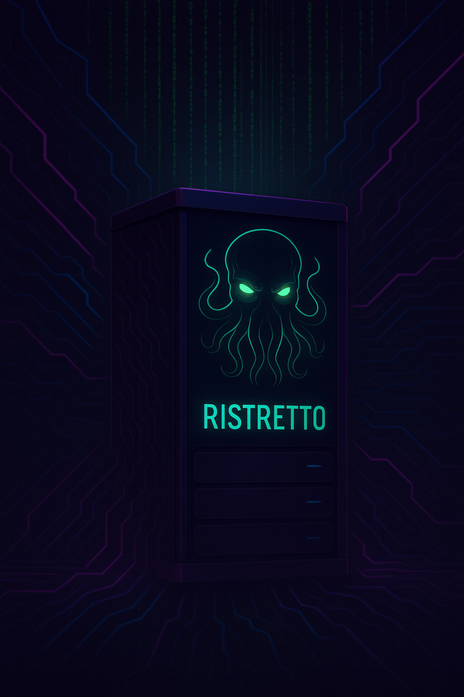

# RistrettoDB

[](https://github.com/MonkeyIsNull/RistrettoDB/actions/workflows/ci.yml)
[](https://github.com/MonkeyIsNull/RistrettoDB/releases/latest)

-blue)


[](https://github.com/MonkeyIsNull/RistrettoDB/commits/main)
[](https://github.com/MonkeyIsNull/RistrettoDB/issues)


[](LICENSE)


> "Bygget på koffein og høy hastighet!"

**RistrettoDB is a fast, embeddable, fixed-schema, append-only, single-writer
telemetry/analytics store written in C.** It stores fixed-width rows in an
mmap-backed file and scans them quickly, in a tiny library you link directly
into your application.

### What it IS

- A high-speed **append + scan** store for logs, telemetry, events, and
  time-series data.
- **Fixed-schema**: declare columns once with a `CREATE TABLE` string; rows are
  fixed width (INTEGER/REAL = 8 bytes, TEXT(n) = n bytes).
- **Embeddable**: one static/dynamic library, or a single-file amalgamation.
- **Persistent**: rows are written to an `mmap`-backed `.rdb` file and survive
  process restarts. NULLs persist and round-trip as NULL.
- **Zero dependencies**, with Go / Python / Node bindings.

### What it is NOT

- **Not a general-purpose SQL database.** There is no query language at runtime:
  no `SELECT`, no `JOIN`, no `UPDATE`/`DELETE`, no transactions, no `WHERE`
  clause. You scan rows and filter in your own code. (The `CREATE TABLE` string
  is only used to declare the schema.)
- **Not multi-writer.** Exactly one writer at a time (advisory `flock`).
- **Not crash-durable (no WAL).** Writes flush with `msync`/`fsync`; rows since
  the last durable flush can be lost on a crash.

> **Status: 0.3.0 — early but real.** The engine, format, and bindings work and
> are tested; the API may still change before 1.0. See
> [CHANGELOG.md](CHANGELOG.md) and [SECURITY.md](SECURITY.md).

Supported platforms: POSIX, little-endian, 64-bit (macOS / Linux on arm64 /
x86-64). Windows, big-endian, and 32-bit are not supported (the format is
native-endian and mmap/`flock`-based).

## Quick Start (5 minutes)

```bash
# 1. Clone and build the library
git clone https://github.com/MonkeyIsNull/RistrettoDB && cd RistrettoDB
make libraries        # produces lib/libristretto.a and lib/libristretto.so
```

Create your first application:

```c
#include "ristretto.h"
#include <stdio.h>

static void print_row(void *ctx, const RistrettoValue *row) {
    (void)ctx;
    printf("  id=%lld name=%s\n",
           (long long)row[0].value.integer,
           row[1].is_null ? "(null)" : row[1].value.text.data);
}

int main(void) {
    printf("RistrettoDB Version: %s\n", ristretto_version());

    RistrettoTable *t = ristretto_table_create("hello",
        "CREATE TABLE hello (id INTEGER, name TEXT(32))");

    RistrettoValue row[2] = {
        ristretto_value_integer(1),
        ristretto_value_text("Hello World"),
    };
    ristretto_table_append_row(t, row);
    ristretto_value_destroy(&row[1]);

    ristretto_table_select(t, print_row, NULL);   /* scan every row */
    ristretto_table_close(t);
    return 0;
}
```

Compile and run:

```bash
cc -O3 -Iembed hello_ristretto.c lib/libristretto.a -o hello_ristretto
./hello_ristretto
```

**Output:**

```
RistrettoDB Version: 0.3.0
  id=1 name=Hello World
```

## Embedding

RistrettoDB is designed for drop-in embedding with zero dependencies.

### Link the library

```bash
make libraries && ls lib/
# libristretto.a     static library  — recommended for embedding
# libristretto.so    dynamic library
```

Include `embed/ristretto.h` and link `lib/libristretto.a` (or `.so`). The
public API is the `ristretto_table_*` / `ristretto_value_*` surface.

### Single-file amalgamation

`scripts/embed.py` generates `embed/ristretto.c`, a single file containing the
whole library. There are two ways to use it:

**Option 1 — fully embedded (single translation unit):**

```c
#define RISTRETTO_EMBEDDED
#include "ristretto.c"   /* note: .c, not .h */
/* ... your code using ristretto_table_* ... */
```

**Option 2 — compile the amalgamation separately and link:**

```bash
# Compile the amalgamation (the RISTRETTO_EMBEDDED define supplies the
# full implementation in one unit)
cc -std=c11 -DRISTRETTO_EMBEDDED -Iembed -c embed/ristretto.c -o ristretto.o

# Compile your program (which #includes ristretto.h) and link
cc -std=c11 -Iembed myapp.c ristretto.o -o myapp
```

### Language bindings

**Python** (ctypes — see [`examples/python/`](examples/python/)):

```python
from ristretto import RistrettoTable, RistrettoValue

with RistrettoTable.create("events",
        "CREATE TABLE events (ts INTEGER, name TEXT(16))") as table:
    table.append_row([RistrettoValue.integer(1672531200),
                      RistrettoValue.text("login")])
    for row in table.scan():      # [[1672531200, "login"]]
        print(row)
```

**Node.js** (koffi — see [`examples/nodejs/`](examples/nodejs/)):

```javascript
const { RistrettoTable, RistrettoValue } = require('./ristretto');

const table = RistrettoTable.create('events',
    'CREATE TABLE events (ts INTEGER, name TEXT(16))');
table.appendRow([RistrettoValue.integer(1672531200), RistrettoValue.text('login')]);
const rows = table.select();      // [[1672531200, 'login']]
table.close();
```

**Go** (cgo — see [`examples/go/`](examples/go/)):

```go
import "github.com/MonkeyIsNull/RistrettoDB/examples/go/ristretto"

// Fast append-only, mmap-backed; stored at data/events.rdb
table, err := ristretto.CreateTable("events",
    "CREATE TABLE events (ts INTEGER, name TEXT(16), value REAL)")
defer table.Close()

err = table.AppendRow([]ristretto.Value{
    ristretto.IntegerValue(1001),
    ristretto.TextValue("login"),
    ristretto.RealValue(1.5),
})

// V2 has no WHERE clause, so Scan returns every row; filter in Go.
all, err := table.Scan()
for _, r := range all {
    fmt.Println(r.Get("ts").Int(), r.Get("name").Text(), r.Get("value").Float())
}
```

### Examples

The [examples/](examples/) directory contains working C demos and the three
language bindings:

- C: [`simple_embed.c`](examples/simple_embed.c),
  [`simple_embed_compat.c`](examples/simple_embed_compat.c),
  [`direct_api_demo.c`](examples/direct_api_demo.c),
  [`embedding_demo.c`](examples/embedding_demo.c) (NULL round-trip),
  [`working_demo.c`](examples/working_demo.c),
  [`raw_api_demo.c`](examples/raw_api_demo.c)
- Bindings: [`python/`](examples/python/), [`nodejs/`](examples/nodejs/),
  [`go/`](examples/go/)

Run them:

```bash
make static
./scripts/build_examples.sh                              # all C examples + amalgamation smoke tests
cd examples/python && python3 example.py                 # Python demo
cd examples/nodejs && npm install && node example.js     # Node demo
cd examples/go && go test ./ristretto && go run ./cmd/example  # Go tests + demo
```

## How it works




RistrettoDB stores each table as a single `.rdb` file: a fixed-size header
followed by fixed-width rows, memory-mapped for zero-copy access. Appends write
straight into the mapped region; scans walk the rows and hand each one to your
callback.

### Data types

- `INTEGER` — 64-bit signed integer (8 bytes)
- `REAL` — double-precision float (8 bytes)
- `TEXT(n)` — fixed-width string, up to 255 bytes (truncated to n-1 bytes + NUL)
- `NULL` — any column may be NULL; NULL-ness persists via a per-row bitmap

### On-disk format (v3)

```
File layout (per table):
┌───────────────────────────────────────────────────────────┐
│                 TableHeader (1024 bytes)                    │
│  Magic(8) | Version(4) | RowSize(4) | NumRows(8) | ...      │
│  ColumnDescs[14] | Reserved(12)                             │
├───────────────────────────────────────────────────────────┤
│                        Row data                             │
│  Row 0 (fixed width) | Row 1 | ... | Row N                  │
└───────────────────────────────────────────────────────────┘

Row layout (fixed width):
┌──────────────┬────────────┬────────────┬────────────┐
│ NULL bitmap  │  Column 0  │  Column 1  │    ...      │
│ (2 bytes)    │ INTEGER(8) │ TEXT(32)   │             │
└──────────────┴────────────┴────────────┴────────────┘
```

Each row begins with a NULL bitmap (bit *i* set ⇒ column *i* is NULL), then the
fixed-width column data. INTEGER/REAL are stored native-endian (little-endian on
supported platforms). The format version is **3**; older v1/v2 `.rdb` files are
rejected cleanly on open (breaking change — recreate your tables).

## Building

### Prerequisites

- Clang (the SIMD-free portable baseline builds with any C11 compiler; the
  Makefile defaults to `clang`)
- POSIX system (Linux, macOS, BSD), little-endian, 64-bit

### Commands

```bash
make                        # build static + dynamic libraries
make libraries              # same as above
make static                 # lib/libristretto.a
make dynamic                # lib/libristretto.so

make test-v2                # Table V2 tests
make test-comprehensive     # comprehensive functionality tests
make test-stress            # stress / performance tests
make test-golden            # golden on-disk format round-trip (NULLs + byte-pin)
make test-all               # all of the above

make example                # build and run a tiny embedding example
make benchmark              # build and run the V2 write-throughput benchmark
make clean                  # remove build artifacts
```

The build uses a portable baseline (no `-march=native`, so binaries run across
microarchitectures). Opt into host tuning with `make SIMD=native`.

## Benchmark


RistrettoDB ships one reproducible benchmark that measures Table V2 write
throughput — `benchmark/ultra_fast_benchmark.c`:

```bash
make benchmark        # builds + runs with the portable baseline (-O3 -std=c11)
```

It reports rows/sec and ns/row for appending 1,000,000 rows of
`(id INTEGER, data TEXT(16))`, plus a `malloc` baseline for context. The exact
number is flag- and machine-sensitive, so the benchmark header pins the config
(compiler flags, row count, schema, machine class) — always quote that config
alongside any number.

There is an **optional** SQLite contrast behind a compile flag
(`make -C benchmark run-ultra-fast WITH_SQLITE=1`). It is off by default and
CI-independent: RistrettoDB has no SQL engine, so this only contrasts the append
path with SQLite's in-memory `INSERT`, a different workload — not an
apples-to-apples speedup claim. See [`benchmark/README.md`](benchmark/README.md).

## Ideal use cases

| Domain              | Examples                      | Why it fits                      |
| ------------------- | ----------------------------- | -------------------------------- |
| Network systems     | Metadata-only packet logging  | High-speed insert, small rows    |
| Security logging    | Audit trails, auth logs       | Fast + append-only               |
| Embedded systems    | Sensors, telemetry, IoT logs  | Fixed-size + zero-dependency     |
| Analytics ingestion | Events, clickstream, traces   | Scalable insert + compact schema |
| Edge logging        | Drones, robotics, car systems | Works offline, no heap overhead  |

**Not a fit for:** anything needing UPDATE/DELETE, JOINs or ad-hoc queries,
transactions, concurrent writers, or a flexible/evolving schema.

## Limitations (by design)

These are deliberate scope boundaries, documented honestly so you can plan
around them:

- **No query language.** No `SELECT`/`WHERE`/`JOIN`/`UPDATE`/`DELETE`/`GROUP BY`/
  `ORDER BY`, no aggregates, no transactions. You scan all rows
  (`table_select`) and filter in your application.
- **No WAL / crash recovery.** Writes flush asynchronously during a run;
  `table_close` does a synchronous `msync(MS_SYNC)` + `fsync`, and
  `ristretto_table_flush_durable` forces a durable flush on demand. A crash
  mid-run can lose rows written since the last durable flush.
- **Single-writer.** Table V2 takes an **advisory** `flock` so a second process
  opening the same live table fails fast. The lock is advisory only and a
  **no-op on some network filesystems (NFS/SMB)**, so it is not a guarantee
  against corruption. There is no in-process locking beyond what callers add
  (the Go binding wraps each handle in a `sync.Mutex`).
- **Destructive convenience create.** The two-argument `table_create` (and Go
  `CreateTable`) **truncates** any existing file. Use
  `table_create_ex(..., RDB_CREATE_NEW)` (`O_EXCL`) for non-destructive create,
  and the `base_dir` argument of `table_create_ex` / `table_open_ex` to choose
  the storage directory (default `data/`).
- **Fixed schema, bounded widths.** Up to 14 columns per table; TEXT limited to
  255 bytes; no `ALTER TABLE`.
- **Breaking on-disk change.** Format v3 adds a per-row NULL bitmap; older
  `.rdb` files are rejected, not migrated.

## Project structure

```
RistrettoDB/
├── src/
│   ├── table_v2.c      # Table V2 engine
│   ├── ristretto_api.c # Public ristretto_* wrappers
│   └── version.c       # Version info
├── include/
│   └── table_v2.h      # Internal engine header
├── embed/
│   ├── ristretto.h     # Single public header
│   ├── ristretto.c     # Generated single-file amalgamation
│   └── test_embedded*.c# Amalgamation smoke tests
├── scripts/
│   ├── embed.py        # Amalgamation generator
│   └── build_examples.sh
├── tests/              # C test suites (incl. golden format + fuzz harness)
├── benchmark/          # V2 write-throughput benchmark
├── examples/           # C examples + Go / Python / Node bindings
└── doc/                # Programming manual
```

## Programming manual

For the full API reference and worked examples, see the
[Programming Manual](doc/PROGRAMMING_MANUAL.md). Run `make test-comprehensive`
and `make test-golden` to validate the manual's claims on your system.

## Contributing

Issues and pull requests are welcome. Found a bug or have an idea? Open an issue. Want to send a change? Fork, make it, and open a PR — please build and run the test suites first (`make && make test-v2 test-comprehensive test-stress`). CI builds and runs the C suites, the amalgamation, and the Go/Python/Node bindings on macOS and Linux, plus ASan/UBSan and a fuzz smoke on Linux.

## License

MIT License — see [LICENSE](LICENSE).

## Inspiration

RistrettoDB is inspired by SQLite's embedded approach and the principle that
constraints enable performance. Named after the concentrated espresso shot: a
small, intense tool for one job done fast.
